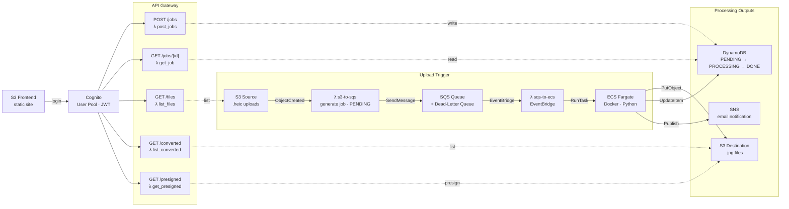

# HEIC to JPG Converter Pipeline

An event-driven, serverless pipeline that converts HEIC photos to JPG using AWS. Upload a HEIC file to S3 and the pipeline automatically converts it, tracks the job status, and notifies you when done.

## Architecture



API Gateway (Cognito authenticated) exposes:
- `POST /jobs` — submit a conversion job
- `GET /jobs/{id}` — check job status
- `GET /files` — list source HEIC files
- `GET /converted` — list converted JPG files
- `GET /presigned` — generate presigned download URL

## Stack

- **Compute** — AWS ECS Fargate (Docker container)
- **Queuing** — AWS SQS with Dead Letter Queue
- **Storage** — AWS S3 (source + destination buckets)
- **Database** — AWS DynamoDB (job tracking)
- **Auth** — AWS Cognito (user pool + JWT)
- **API** — AWS API Gateway REST API
- **Notifications** — AWS SNS (email)
- **IaC** — Terraform
- **CI/CD** — GitHub Actions

## Project Structure

```
heic-converter/
├── converter/                  # ECS Fargate container
│   ├── main.py
│   ├── Dockerfile
│   └── requirements.txt
├── lambda-submit-sqs/          # S3 → SQS trigger
│   └── lambda.py
├── lambda-sqs-to-ecs/          # SQS → ECS trigger
│   └── sqs_to_ecs.py
├── lambda-post-jobs/           # POST /jobs
│   └── post_jobs.py
├── lambda-get-job/             # GET /jobs/{id}
│   └── get_job.py
├── lambda-list-files/          # GET /files
│   └── list_files.py
├── lambda-list-converted/      # GET /converted
│   └── list_converted.py
├── lambda-get-presigned/       # GET /presigned
│   └── get_presigned_url.py
├── frontend/                   # S3 static website
│   ├── main.tf
│   └── index/
│       └── index.html
└── terraform/                  # Backend infrastructure
    ├── main.tf
    ├── networking.tf
    ├── ecs.tf
    ├── iam.tf
    ├── lambdas.tf
    ├── api_gateway.tf
    ├── cognito.tf
    ├── monitoring.tf
    ├── queuing.tf
    └── variables.tf
```

## Prerequisites

- AWS CLI configured with appropriate permissions
- Terraform >= 1.0
- Docker
- An S3 bucket for Terraform state
- An existing S3 source bucket for HEIC uploads

## Deploy

### 1. Deploy the frontend

```bash
cd frontend
terraform init -backend-config=backend.tfvars
terraform apply
# note the s3_website_url output
```

### 2. Deploy the backend

Copy the example vars file and fill in your values:

```bash
cp terraform/terraform.tfvars.example terraform/terraform.tfvars
```

```bash
cd terraform
terraform init -backend-config=backend.tfvars  # ← only if you created this file
# OR pass values directly
terraform init \
  -backend-config="bucket=your-state-bucket" \
  -backend-config="key=converter/terraform.tfstate" \
  -backend-config="region=ap-southeast-2"

terraform apply
```

### 3. Configure the frontend

Update `frontend/index/index.html` with your values:
```js
const COGNITO_CLIENT_ID = 'your-cognito-client-id';
const API_BASE_URL      = 'your-api-gateway-url';
```

### 4. Create a Cognito user

```bash
aws cognito-idp sign-up \
  --client-id YOUR_CLIENT_ID \
  --username your@email.com \
  --password YourPassword123!

aws cognito-idp admin-confirm-sign-up \
  --user-pool-id YOUR_USER_POOL_ID \
  --username your@email.com
```

## CI/CD

GitHub Actions automatically builds and pushes the Docker image to ECR and runs `terraform apply` on every push to `main`.

Three workflows are included:
- **`docker-build-push.yml`** — builds Docker image, pushes to ECR, runs `terraform apply` on push to `main`
- **`terraform-plan.yml`** — runs `terraform plan` and posts output as a PR comment
- **`terraform-destroy.yml`** — manually triggered, tears down all infrastructure

### Required GitHub Secrets

Go to your repo → Settings → Secrets and variables → Actions and add:

| Secret | Description |
|---|---|
| `AWS_ACCESS_KEY_ID` | AWS access key |
| `AWS_SECRET_ACCESS_KEY` | AWS secret key |
| `TF_STATE_BUCKET` | S3 bucket name for Terraform state |
| `SOURCE_BUCKET` | S3 bucket name containing source HEIC files |
| `NOTIFICATION_EMAIL` | Email for SNS notifications |
| `FRONTEND_URL` | URL of the deployed frontend S3 static website |

## Environment Variables

### ECS Task

| Variable | Description |
|---|---|
| `SOURCE_BUCKET` | S3 bucket containing HEIC files |
| `DESTINATION_BUCKET` | S3 bucket for converted JPGs |
| `SQS_QUEUE_URL` | SQS queue URL |
| `SNS_TOPIC_ARN` | SNS topic for notifications |
| `DYNAMODB_TABLE` | DynamoDB table for job tracking |

### Terraform Variables

| Variable | Description |
|---|---|
| `source_bucket` | Name of the source S3 bucket |
| `notification_email` | Email for SNS notifications |
| `frontend_url` | URL of the deployed frontend |
| `image_tag` | Docker image tag to deploy |

## Future Improvements

- ECS Service autoscaling based on SQS queue depth for large scale workloads (100k+ images)
- AWS Batch as an alternative compute backend for cost optimisation
- CloudFront distribution in front of the S3 frontend